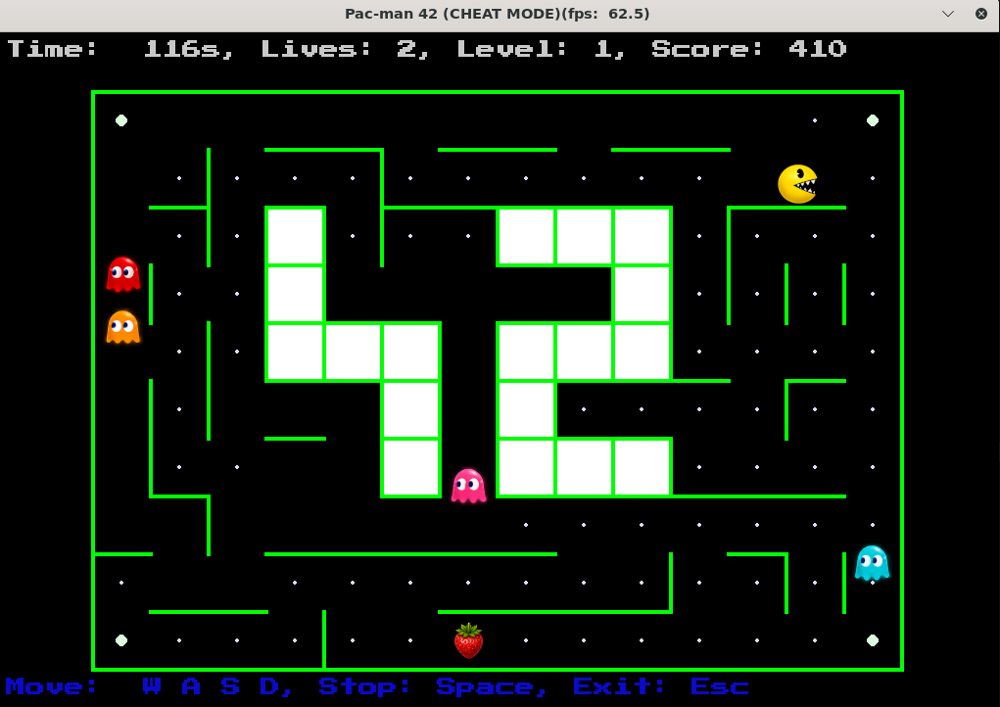

# Pac-Man 42

## Game screen example



## Instructions

### Installation

```bash
make install
```
This target creates/uses `.venv` and installs dependencies (including `pygame-ce`, `pydantic`, maze generator wheel, linting tools, etc.).

### Usage

```bash
# Run with default configuration
make run

# Run with your configuration
make run my_config.json

# Run directly with Python
python3 pac-man.py my_config.json
```

## Play

### Controls

- **W** or **⇧** - Move Up
- **A** or **⇦** - Move Left
- **S** or **⇩** - Move Down
- **D** or **⇨** - Move Right
- **Space** - Stop
- **Esc** - Pause / Exit game
- **F11** - Full screan 

#### Cheat mode

If you started game with ``` "cheat":  true ``` in config.json - for you available the following additional options:
- **1** - Invincibility (no life lost; ghosts cannot eat the player).
- **2** - Level skip (immediately win the current level).
- **3** - Ghost freeze (ghosts stop moving).
- **4** - Extra lives (add extra lives to the player).
- **5** - Increased speed (player moves faster).
- **6** - Decreased speed (player moves slower).
- **7** - Change ghost mode.
- **F** - Ghosts SCATTER


### Configuration

The configuration file controls the maze generation physics and rules.

```json
{
"highscore_filename": "pc_score.json",
"lives": 3,
"points_per_pacgum" : 10,
"points_per_super_pacgum" : 50,
"points_per_ghost" : 200,
"cheat": true,
"levels": [
	{
	"number": 1,
	"width": 14,
	"height": 10,
	"pacgum" : 42,
	"seed": 42,
	"level_max_time": 130,
	"bonus_fruit_type": "Strawberry",
	"points_per_bonus_fruit": 300,
	"remove_deadends": true,
	"speed_factor_ghost": 0.04,
	"max_player_acceleration": 6,
	"walls_color": "#1e2ac9"
	},
	{
	"number": 100,
	"map_filename": "inc/maps/maze.txt"
	}
	]
}
```
#### Key notes

- Unknown keys are ignored.
- Missing/invalid values are replaced with safe defaults where applicable.
- Typical tunables:
  - player lives
  - scoring values
  - level dimensions and timers
  - random seed
  - cheat mode
  - highscore output file path/name

---
## Highscore

The project uses a persistent highscore system stored in JSON (`highscores_filename` from config, default `highscores.json`).

### Behavior

- Highscores are loaded at game start.
- At game end (win or lose), player decides to quit or to store their score. If yes, player enters a name and score is stored.
- Name rules:
  - max 10 characters
  - alphanumeric + spaces
- Score rules:
  - non-negative integer
- Top 10 entries are kept and saved to disk.

## License

Part of the 42 curriculum project.
